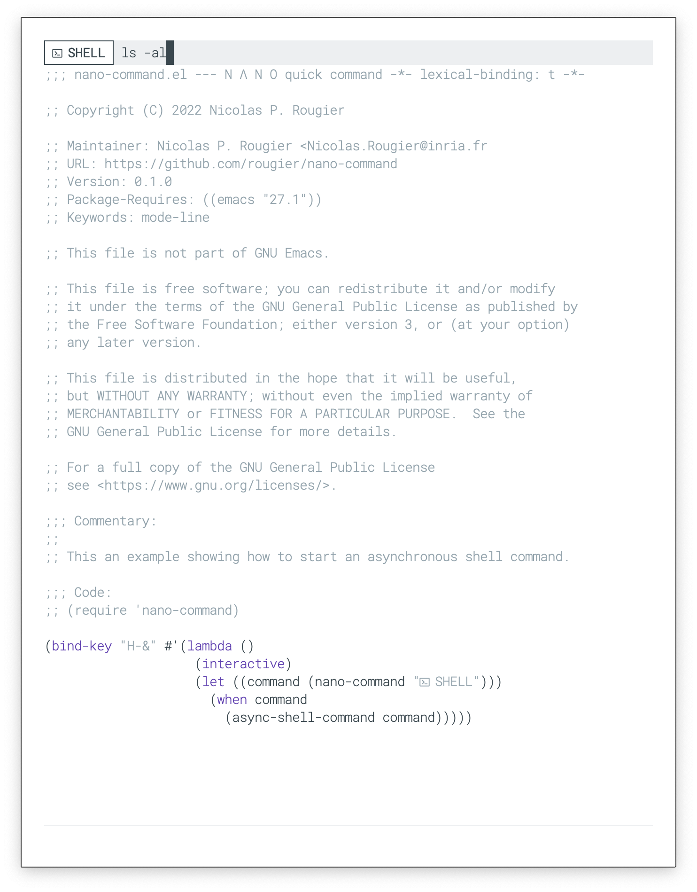

## N Λ N O Command

Nano command allows the user to enter some text in the mode-line or
the header-line (instead of the minibuffer area). This can be used for
entering quick commands that do not need all the minibuffer machinery.

### Installation

Install with `M-: (package-install 'nano-command)`

### Usage example:

- [nano-capture-inbox.el](nano-capture-inbox.el)
- [nano-capture-meeting.el](nano-capture-meeting.el)
- [nano-mu4e-forward.el](nano-mu4e-forward.el)
- [nano-mu4e-reply.el](nano-mu4e-reply.el)
- [nano-async-shell.el](nano-async-shell.el)

### Screenshots

